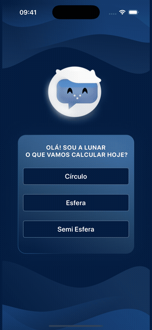
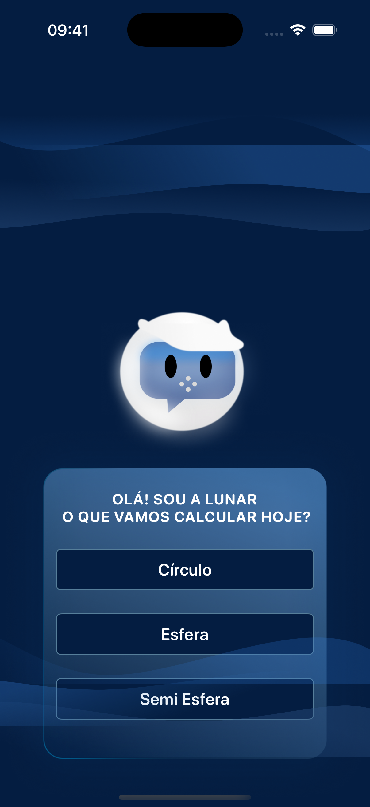
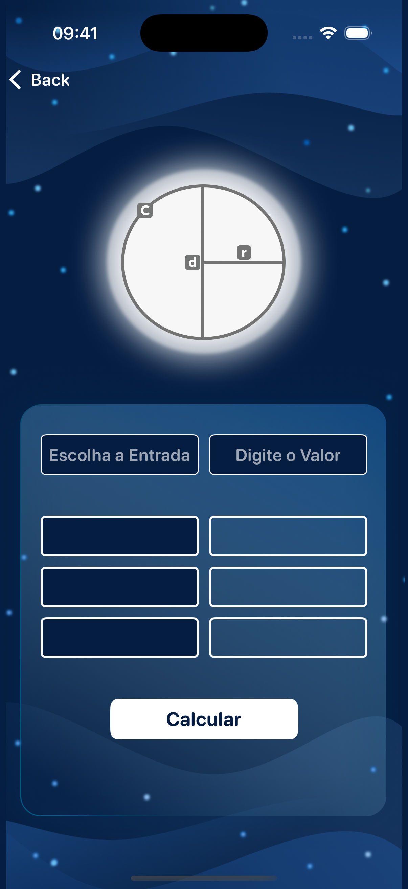

<div align="center">

# Lunar

Calculadora geométrica iOS com tema lunar, animações fluidas e personagem interativa — UIKit · Coordinator Pattern

[](https://swift.org)
[](https://developer.apple.com/documentation/uikit)
[](https://developer.apple.com/xcode/)

</div>

---

## Demo

<div align="center">

</div>

---

## Sobre o projeto

Lunar é um app iOS educativo de geometria com identidade visual inspirada no espaço. A personagem Lunar guia o usuário no cálculo de propriedades do círculo — raio, diâmetro, circunferência e área — a partir de qualquer valor conhecido. Toda a interface foi construída programaticamente com UIKit, sem storyboards, usando Auto Layout e animações customizadas. Projeto desenvolvido no Apple Developer Academy — CIn-UFPE.

---

## Funcionalidades

- Personagem Lunar com animação frame-by-frame (8 sprites) e efeito flutuante
- Calculadora de círculo que calcula raio, diâmetro, circunferência e área a partir de qualquer valor inserido
- Picker de propriedades — selecione qual valor inserir e os demais são calculados automaticamente
- Animações de nuvens superiores e inferiores com bounce contínuo
- Fundo estelar animado na tela de cálculo
- Diagrama interativo com representação visual de raio, diâmetro e área
- Interface 100% programática com ViewCode e Auto Layout, sem storyboards

---

## Tecnologias

- Swift — linguagem principal
- UIKit — toda a interface construída programaticamente
- Auto Layout com constraints programáticas
- UIView.animate para animações fluidas e recursivas
- UIPickerView para seleção de propriedades geométricas
- Coordinator Pattern para navegação desacoplada entre telas

---

## Arquitetura

```
Luna/
├── Application/
│   ├── AppDelegate.swift
│   └── SceneDelegate.swift
├── Sources/
│   ├── Circle/
│   │   ├── Calculation.swift
│   │   ├── CircleView.swift
│   │   └── CircleViewController.swift
│   ├── CloudView/
│   │   ├── CloudBottomView.swift
│   │   └── CloudTopView.swift
│   ├── Coordinator/
│   │   ├── Coordinator.swift
│   │   └── MainCoordinator.swift
│   ├── Extensions/
│   │   └── UIFont+Rounded.swift
│   └── Intro/
│       ├── Controller/
│       │   └── IntroViewController.swift
│       └── View/
│           ├── IntroView.swift
│           └── LunaView.swift
└── Resources/
    └── Assets.xcassets/
```

---

## Como executar

1. Clone o repositório:

```bash
git clone https://github.com/GeozedequeGuimaraes/Lunar.git
```

2. Abra `Luna.xcodeproj` no Xcode
3. Selecione um simulador ou dispositivo físico (iOS 17+)
4. Execute com `Cmd + R`

---

## Screenshots

<div align="center">

| Tela inicial | Calculadora |
|:---:|:---:|
|  |  |

</div>

---

## Autor

<div align="center">

Geozedeque Guimarães — Estudante de Ciência da Computação, CIn-UFPE

[](https://github.com/GeozedequeGuimaraes)
[](https://linkedin.com/in/geozedeque-guimaraes)

</div>
